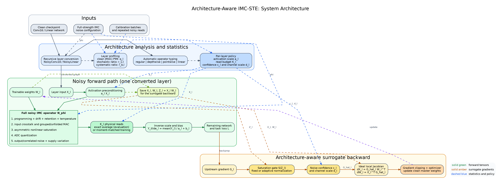
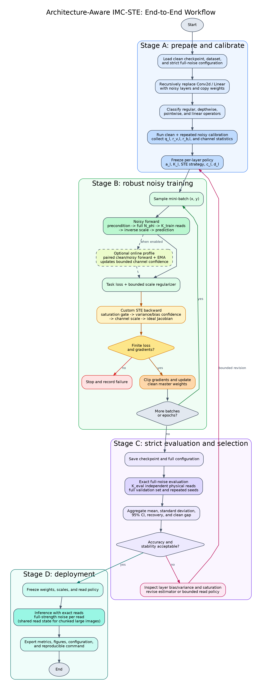

# IMC-STE 算法架构图与流程图

本文档描述当前项目中已经实现并经过实验验证的 Architecture-Aware IMC-STE。图中的英文标签可直接用于英文论文或答辩；本页提供中文解释以及图和代码之间的对应关系。

## 1. 算法总体架构



矢量版本：[PDF](figures/algorithm_architecture.pdf) | [SVG](figures/algorithm_architecture.svg) | [Graphviz 源文件](diagrams/algorithm_architecture.dot)

总体架构包含四条相互配合的路径：

1. **模型转换路径**：递归识别原始网络中的 `Conv2d` 和 `Linear`，替换为 `NoisyConv2d` 和 `NoisyLinear`，复制干净权重，并自动区分普通卷积、depthwise、pointwise 和线性层。
2. **统计与策略路径**：利用校准数据估计每层干净 MAC 输出的 P99、随机误差/信号比、系统误差/信号比及可选的通道统计，再生成每层激活缩放、读次数和梯度置信度。
3. **完整噪声前向路径**：每次物理读都使用完整噪声强度，依次模拟权重编程/漂移/保持/温度误差、输入串扰、矩阵乘、非对称饱和、ADC 量化、输出噪声、空间相关噪声和电源波动。多读只平均独立读出，不降低单次读出的噪声。
4. **STE 反向路径**：使用干净局部 Jacobian 传播梯度，并可依次应用饱和导数、层级方差/偏差置信度和通道置信度。优化器更新的是 clean master weights，下一次前向再由完整噪声算子产生随机映射。

### 1.1 核心前向

对第 (l) 层，统计驱动的激活预条件为

\[
a_l=\operatorname{clip}(\tau/q_l,a_{\min},1),\qquad
\widetilde{Y}_l=\frac{1}{a_lK_l}\sum_{k=1}^{K_l}
\mathcal{N}_{\phi}(a_lX_l,W_l;\xi_{l,k})+b_l.
\]

其中 (q_l) 是干净 MAC 输出绝对值的 P99，(K_l) 是该层的物理读次数，
\(\mathcal{N}_{\phi}\) 是完整强度的噪声算子。输入缩放把高幅值 MAC 拉回非线性的有效区间；输出除以 (a_l) 保持理想线性映射不变。

### 1.2 核心反向

对于上游梯度 (G_l)，当前框架支持以下组合式代理梯度：

\[
\widehat{G}_l=G_l\odot S(Z_l)\odot d_l\,c_l,
\]

\[
\widehat{\nabla_{X_l}\mathcal{L}}=\widehat{G}_lW_l^\top,
\qquad
\widehat{\nabla_{W_l}\mathcal{L}}=X_l^\top\widehat{G}_l.
\]

其中 (Z_l=X_lW_l) 是保存的理想预激活，(S(Z_l)) 是带梯度下限的饱和感知缩放，(d_l) 是可选通道缩放，层级置信度为

\[
c_l=\max\!\left(c_{\min},
\left(1+\lambda_v r_{v,l}^{2}/K_l+\lambda_b r_{b,l}^{2}\right)^{-1/2}\right).
\]

随机误差项随独立读次数近似按 (1/K_l) 下降，系统偏差项不会被多读消除。实验表明，反向置信度主要用于稳定梯度；当前最大精度增益主要来自前向激活预条件与针对敏感层的 read-aware 训练。

## 2. 端到端训练、验证与部署流程



矢量版本：[PDF](figures/training_workflow.pdf) | [SVG](figures/training_workflow.svg) | [Graphviz 源文件](diagrams/training_workflow.dot)

完整流程分为四个阶段：

1. **准备与校准**：加载干净模型和严格噪声配置，转换网络，识别层类型，采集每层统计并冻结初始策略。
2. **噪声鲁棒训练**：对每个 mini-batch 执行预条件、多读噪声前向、任务损失、定制 STE 反向、有限值检查、梯度裁剪和参数更新。在线通道 profile 是可选模块，不是主结果成立的前提。
3. **严格评估**：使用完整验证集、多个 seed 和真实的 (K_{eval}) 次独立读出，报告均值、标准差、95% 置信区间、相对 direct-noisy 的恢复量以及相对 clean 的精度差。
4. **部署与归档**：冻结权重、激活尺度和读策略，以 exact-read 模式部署，并保存 checkpoint、噪声配置、统计表、图和复现命令。

## 3. 大图卷积路径

检测和分割中的大分辨率特征图采用分块 unfold，但物理噪声状态遵循“每次读出共享”的语义：

- 编程、漂移、保持、温度和全局电源状态在一次物理读内只采样一次，并在所有空间块和 MAC tile 之间复用。
- 输入串扰和输出噪声仍然按位置采样。
- 分块只降低 unfold 工作区，不应改变噪声分布或产生额外的空间平均。

这一设计对应架构图中完整噪声算子内部的 grouped/unfolded MAC，也对应流程图部署阶段的 shared read state。

## 4. 图中模块与代码对应关系

| 图中模块 | 主要实现 |
|---|---|
| 递归模型转换与层类型识别 | `src/imc_ste/convert.py` |
| 完整噪声算子与物理读状态 | `src/imc_ste/noise.py` |
| NoisyLinear、NoisyConv2d、多读和大图分块 | `src/imc_ste/layers.py` |
| identity / saturation / variance-aware STE | `src/imc_ste/ste.py` |
| 离线激活范围与梯度统计配置 | `src/imc_ste/convert.py` |
| 在线通道 profile | `src/imc_ste/online_profile.py` |
| 训练入口与实验参数 | `scripts/train.py` |
| 层级噪声统计和可视化 | `scripts/analyze_layer_noise_stats.py`、`scripts/plot_results.py` |

## 5. 主线与可选模块边界

- **主线**：完整噪声 forward、通用 Conv/Linear 转换、STE backward、激活预条件、敏感层多读训练和 exact-read 评估。
- **增强模块**：层级/通道方差置信度、可学习但有界的激活尺度、moment-matched 多读训练近似。
- **工程模块**：大图分块、MAC tiling 和一次物理读内共享权重噪声状态。
- **诊断模块**：在线 clean/noisy 成对 profile、层级随机/系统误差分解和 read-budget sweep。

## 6. 重新生成图片

系统安装 Graphviz 后运行：

```bash
cd /home/kylinsu/worksapce/imc_ste_challenge/docs/diagrams
make
```

该命令同时生成适合 Markdown 预览的 240 DPI PNG、适合 LaTeX 的矢量 PDF，以及方便继续编辑的 SVG。
