# 存算噪声感知 STE 框架设计与验证

**2026 INNO 存算算法赛道五 · 赛题二技术报告**

**作者：Xin Su**

版本：1.1  
更新日期：2026-08-28

本文依据赛题任务书 `2026INNO_CIM.docx` 整理。报告中的主结果、辅助分析和 optional 机制验证采用不同口径，并在正文与结论边界中分别标明。

## 摘要

本项目面向存算一体芯片中的非理想矩阵乘与卷积计算，设计并实现了一个通用的噪声感知直通估计器框架。框架覆盖编程误差、漂移、非线性、输出噪声、量化、串扰、温度扰动、保持损失和电源扰动等多类非理想因素，并支持线性层、普通卷积、grouped convolution 和 depthwise convolution。方法以 STE 文献中的 surrogate-gradient 思路为基础，并针对模拟存算噪声的偏差、方差与饱和耦合进行扩展 [2-4]。

实验在 CIFAR-10、CIFAR-100 和 TinyImageNet 上验证 ResNet18 与 EfficientNet-B0。主线结果采用严格统一噪声口径：所有 Conv/Linear 层均承受 `noise_scale=1.0`，不通过逐层降噪或保护特殊层降低任务难度。结果显示，标准 noisy training 往往梯度退化或训练不稳定，而 STE 类方法可以恢复有效梯度传播。在严格统一噪声下，CIFAR-10 + ResNet18 从 direct noisy 的 61.42% 恢复到 90.63%；CIFAR-10 + EfficientNet-B0 从 38.93% 恢复到 86.12%；TinyImageNet + EfficientNet-B0 通过统计驱动的激活预条件、STE 微调和敏感层多次读出，从 0.50% 恢复到 5-seed full-val 76.30% ± 0.25% CI95，保留 94.20% clean 精度。输出噪声感知读预算进一步在精度差异不显著的情况下减少 25.5% 敏感层读次数。逐层降噪结果仅作为辅助硬件映射分析，不作为主线算法结果。

## 题目要求对齐

| 要求 | 完成状态 | 证据 |
| --- | --- | --- |
| 通用 STE 框架 | 已完成 | `NoisyLinear`、`NoisyConv2d`、`ste_matmul`、`ste_grouped_matmul` |
| 复杂噪声处理 | 已完成 | `NoiseConfig` 覆盖 9 类非理想因素 |
| 卷积层和线性层适配 | 已完成 | ResNet18 和 EfficientNet-B0 均完成正式实验 |
| 多架构适配机制 | 已完成 | 层类型识别、激活预条件、read-aware 训练与评估 |
| 梯度估计优化 | 已完成 | 标准、饱和感知、自适应饱和感知、方差感知 STE |
| 领域任务验证 | 已完成必选分类任务 | CIFAR-10、CIFAR-100、TinyImageNet |
| 综合统计分析 | 已完成 | CI95、Welch t-test、ANOVA、effect size |
| 官方推荐工具对照 | 已完成 sanity check | MemIntelli、mPimPy 矩阵乘误差对照 |
| 目标检测扩展验证 | VOC2007 shared-read 内部层级验证 | Faster R-CNN full-val：28.72% direct noisy，37.53% STE mAP50 |
| 语义分割扩展验证 | VOC2012 shared-read 内部层级验证 | DeepLabV3 full-val：4.03% direct noisy，6.46% STE mIoU |

## 方法

### 噪声前向模型

对理想矩阵乘 $Y=XW$，框架在前向传播中引入权重扰动、输入相关扰动、非线性、量化和输出扰动，得到噪声输出：

$$
\tilde{Y} = Q_b(f(X, W + \Delta W)) + \Delta Y. \tag{1}
$$

其中 $Q_b$ 表示 bit-width 量化，$\Delta W$ 覆盖 programming noise、drift、retention loss 和 temperature variation，$\Delta Y$ 覆盖 output noise、crosstalk 和 supply variation。非线性使用正负不对称饱和函数：

$$
f(z)=\begin{cases}\tanh(\alpha z)/\alpha,&z\ge 0\\
\tanh((\alpha+\beta)z)/(\alpha+\beta),&z<0\end{cases}. \tag{2}
$$

卷积层通过 unfold 将局部 patch 转换为矩阵乘。对 grouped/depthwise convolution，框架使用 grouped matmul 路径，避免将不同 group 的权重混合。

### STE 梯度估计

由于 noisy forward 包含量化和随机扰动，直接 autograd 容易出现零梯度或高方差梯度。标准 STE 在 backward 中使用理想矩阵乘的 surrogate gradient：

$$
\frac{\partial L}{\partial X} \approx \frac{\partial L}{\partial \tilde{Y}} W^T,
\quad
\frac{\partial L}{\partial W} \approx X^T \frac{\partial L}{\partial \tilde{Y}}. \tag{3}
$$

在此基础上，`sat_aware_ste` 引入饱和感知缩放，降低大幅激活/权重区域的梯度不稳定性：

$$
g_\text{sat}=g_\text{ste}\cdot s(X,W). \tag{4}
$$

`adaptive_sat_aware_ste` 进一步根据局部响应尺度归一化缩放系数。新增的方差感知模式把逐层测得的随机误差比 $r_{v,l}$、系统偏差比 $r_{b,l}$ 和读出次数 $K_l$ 接入 backward：

$$
c_l=\max\left(c_{\min},\left(1+\lambda_v r_{v,l}^2/K_l+\lambda_b r_{b,l}^2\right)^{-1/2}\right),
\quad g_l=c_l g_{\mathrm{STE}}. \tag{5}
$$

该机制支持普通卷积、depthwise、pointwise 和 linear 使用不同统计与强度。消融结果显示，它显著稳定梯度范数，但在本轮 TinyImageNet 最优设置中没有超过更简单的 plain STE，因此作为完整框架能力和负结果保留。

### 统计驱动的激活预条件

逐层分解表明，TinyImageNet EfficientNet-B0 的主要误差不是纯随机方差，而是大幅 pre-BN MAC 输出与非线性饱和耦合产生的系统偏差。对第 $l$ 层，从 clean checkpoint 统计 MAC 输出绝对值的 P99 $q_l$，设置

$$
a_l=\operatorname{clip}(\tau/q_l,a_{\min},1),\qquad
\tilde{Y}_l=a_l^{-1}\mathcal{N}(a_l X_l,W_l). \tag{6}
$$

其中 $\tau=4$，只对 depthwise/pointwise 层启用。在无噪声线性极限下，该变换严格保持 $X_lW_l$；每次 noisy MAC 的噪声参数仍为原始 `noise_scale=1.0`。与缩小权重后再放大输出不同，输入缩放不会在一阶近似下放大 additive programming noise，但会放大较小的输出端噪声，因而需要通过验证选择 $a_{\min}$。

### 受约束可学习缩放与输出噪声补偿

固定 P99 缩放基础上，将实际发生预条件的 50 层改写为有界参数：

$$
a_l=a_{\min}+(a_{\max}-a_{\min})\sigma(\theta_l),\qquad
R_a=\frac{1}{L}\sum_l(\log a_l-\log a_l^{(0)})^2. \tag{7}
$$

其中 $a_l^{(0)}$ 为统计初始化，$a_{\min}=0.1$、$a_{\max}=1$。约束和对数正则防止缩放偏离已验证的线性区间。由于输出反缩放会使 additive output noise 方差按 $1/a_l^2$ 增长，框架进一步分配

$$
K_l=\operatorname{clip}(\lceil K_0/a_l^2\rceil,K_0,K_{\max}). \tag{8}
$$

次真实独立读出。本轮效率点使用 $K_0=4$、$K_{\max}=8$。每次读出的 `noise_scale` 仍为 1.0；该策略改变采样预算，不改变物理噪声幅度。

训练期还实现 moment-matched 多读近似：随机零均值噪声项按 $1/\sqrt{K}$ 缩放，非线性和量化系统项保持不变，以一次物理 noisy forward 近似 $K$ 读均值。2-batch 配对基准中，它将训练时间从 48.59 s/batch 降至 1.00 s/batch，约 48.7x。该近似用于降低训练成本，正式评估始终使用精确多读。

### 多架构适配

ResNet18 主要由普通卷积和线性层组成，统一噪声模型即可完成主要验证。EfficientNet-B0 包含大量 depthwise convolution 和 1x1 pointwise convolution。实验表明，统一噪声注入会使 EfficientNet-B0 在 TinyImageNet 上接近随机精度，因此框架提供以下适配机制：

- `dw_clean_*` 模式：depthwise 层使用 clean path，其余层保持 noisy/STE path。
- `depthwise_noise_scale`、`pointwise_noise_scale`、`linear_noise_scale`：对不同层类型施加不同非理想强度。
- layer-wise sweep：在 checkpoint 上扫描逐层噪声尺度，定位主要敏感层。
- activation preconditioning：按 clean P99 自动设置输入缩放与输出反缩放，保持理想算子不变并缓解饱和。
- layer read repeats：训练使用 pointwise/depthwise 4 读，部署评估使用 8 读，不改变单次 MAC 噪声强度。
- constrained learnable activation scale：从 clean P99 初始化逐层有界缩放，并用对数正则限制漂移。
- output-noise read compensation：按反缩放后的输出噪声方差分配 4 到 8 次真实读出。
- moment-matched read approximation：用于低成本训练，验证阶段自动恢复精确多读。

### 符号表

| 符号 | 含义 |
| --- | --- |
| $X,W,Y$ | 输入、权重与理想矩阵乘输出 |
| $\tilde Y$ | 含非理想因素的 noisy 输出 |
| $Q_b$ | $b$ bit 量化算子 |
| $\Delta W,\Delta Y$ | 权重侧和输出侧扰动 |
| $a_l$ | 第 $l$ 层激活预条件缩放 |
| $K_l$ | 第 $l$ 层独立物理读出次数 |
| $r_{v,l},r_{b,l}$ | 随机误差与系统偏差相对信号比 |
| $c_l,d_c$ | 层级或通道级 surrogate gradient 缩放 |
| $F(\theta),F_*$ | 噪声训练目标及其下界 |
| $L,B,\sigma_g^2$ | smoothness、梯度估计偏差上界和方差上界 |

## 理论分析与性能界限

令 $\hat g_t$ 为第 $t$ 步 STE gradient，并定义条件偏差和方差：

$$
\mathbb{E}_t[\hat g_t]=\nabla F(\theta_t)+b_t,
\qquad
\mathbb{E}_t\|\hat g_t-\mathbb{E}_t\hat g_t\|^2\leq\sigma_g^2. \tag{9}
$$

其均方估计误差由系统偏差和随机方差组成：

$$
\mathbb{E}_t\|\hat g_t-\nabla F(\theta_t)\|^2
=\|b_t\|^2+
\mathbb{E}_t\|\hat g_t-\mathbb{E}_t\hat g_t\|^2. \tag{10}
$$

在线 profile 产生对角缩放 $D_t$，每个通道满足 $d_c\in[d_{\min},1]$，因此

$$
d_{\min}\|g\|_2\leq\|D_tg\|_2\leq\|g\|_2. \tag{11}
$$

这使高方差通道的梯度不会被放大，同时由 floor 防止梯度完全消失。若 $F$ 为 $L$-smooth 且下界为 $F_*$，$\|b_t\|\leq B$，并取固定步长 $0<\eta\leq1/(4L)$，则标准 smoothness 推导给出

$$
\frac{1}{T}\sum_{t=0}^{T-1}\mathbb{E}\|\nabla F(\theta_t)\|^2
\leq
\frac{2(F(\theta_0)-F_*)}{\eta T}
+2(1+L\eta)B^2+L\eta\sigma_g^2. \tag{12}
$$

当 $B=0$ 且 $\eta=\mathcal{O}(T^{-1/2})$ 时，式 (12) 恢复 $\mathcal{O}(T^{-1/2})$ 的非凸随机优化平均驻点界 [5]；有偏 STE 则收敛到由 $B^2$ 控制的邻域。该结果解释了饱和修正、激活预条件和在线 bias/variance profile 分别降低偏差或方差的目标，但不直接保证分类精度。当前 $D_t$ 与同一 batch 的 noisy forward 存在相关性，严格自适应证明还需要额外稳定性条件，因此算法有效性仍以配对多 seed 结果判断。完整推导见 `docs/theory_and_complexity.md`。

对 $[R,I]\times[I,O]$ 矩阵乘，clean/noisy/STE 的主阶时间均为 $\Theta(RIO)$；严格 $K$ 读为 $\Theta(KRIO)$，在线 profile 为两次 forward 加一次 backward，渐近阶不变但常数增大。卷积 full-unfold workspace 为 $\mathcal{O}(NH_oW_oC_{in}k_hk_w)$；按 $h_c$ 个输出行分块后降为

$$
\mathcal{O}(Nh_cW_oC_{in}k_hk_w). \tag{13}
$$

shared-read 使权重侧状态跨 chunk 复用，故分块只改变峰值内存，不改变物理噪声语义。在线 profile 的额外持久状态为每层 $\mathcal{O}(C_{out})$，推理阶段不启用 profile，因此没有额外推理成本。

## 实验设置

### 数据集与模型

| 数据集 | 模型 | 用途 |
| --- | --- | --- |
| CIFAR-10 | ResNet18 | 主要精度目标与 STE 主线验证 |
| CIFAR-10 | EfficientNet-B0 | 多架构适配验证 |
| CIFAR-100 | ResNet18 | 更高类别数下的鲁棒性验证 |
| CIFAR-100 | EfficientNet-B0 | 更高类别数 + EfficientNet 结构验证 |
| TinyImageNet | ResNet18 ImageNet-224 | ImageNet-like 分类验证 |
| TinyImageNet | EfficientNet-B0 ImageNet-224 | ImageNet-like + 多架构适配验证 |

ResNet18 与 EfficientNet-B0 分别遵循文献 [8,9] 的经典结构；optional 使用 Faster R-CNN 与 DeepLabV3 [10,11]。经出题方确认，本项目使用 TinyImageNet 作为 ImageNet 方向的可执行替代，但不将其数值表述为完整 ImageNet-1K 精度。

### 评估协议

- clean eval: 理想数字计算基线。
- direct noisy eval: clean checkpoint 直接部署到 noisy path。
- STE noisy fine-tune: 以 clean checkpoint 初始化，在 noisy forward + STE backward 下微调。
- strict uniform noisy eval: 主线协议，所有 Conv/Linear 层使用同一 `noise_scale=1.0` 噪声模型。
- layer-wise calibrated noisy eval: 辅助分析，对 depthwise/pointwise/linear 层使用不同噪声尺度后评估，不作为主线算法结果。
- repeat eval: 对 noisy eval 做 3 到 5 次重复采样，报告 mean 和 95% CI。

## 主要结果

### 严格统一噪声主结果

数据来源：`runs/main_uniform_noise_summary.csv`

| 任务 | Clean eval | Direct uniform noisy | Best uniform STE | Recovery | Retained clean |
| --- | ---: | ---: | ---: | ---: | ---: |
| CIFAR-10 + ResNet18 | 95.62% | 61.42% | 90.63% | +29.21 pp | 94.78% |
| CIFAR-10 + EfficientNet-B0 | 91.13% | 38.93% | 86.12% | +47.19 pp | 94.50% |
| CIFAR-100 + ResNet18 | 78.32% | 62.98% | 69.96% | +6.98 pp | 89.33% |
| CIFAR-100 + EfficientNet-B0 | 71.14% | 27.76% | 61.60% | +33.84 pp | 86.60% |
| TinyImageNet + ResNet18 ImageNet-224 | 71.60% | 53.83% | 58.07% | +4.24 pp | 81.10% |
| TinyImageNet + EfficientNet-B0 ImageNet-224 | 81.00% | 0.50% | 76.30% ± 0.25% | +75.80 pp | 94.20% |

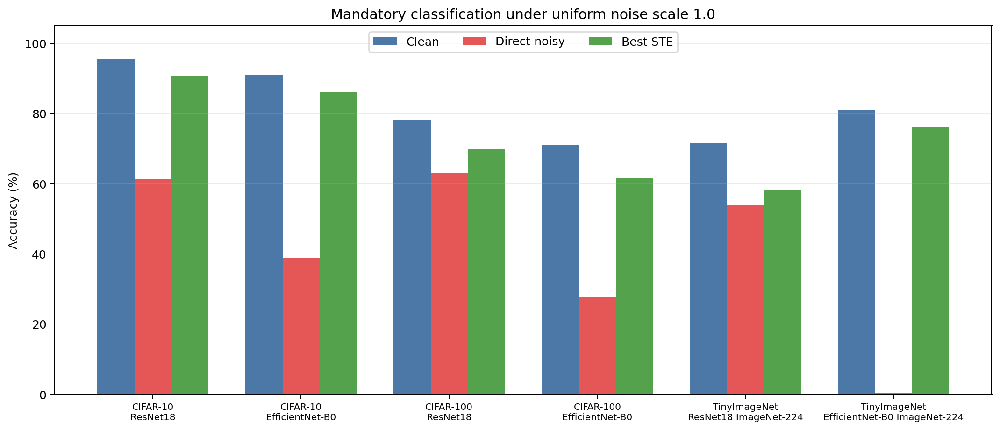

*图 1. 六项必选分类组合在统一 `noise_scale=1.0` 下的结果。TinyImageNet + EfficientNet-B0 的 direct noisy 接近随机，而激活预条件与 read-aware STE 恢复到 76.30%。*

结论：

- CIFAR-10 + ResNet18 在严格统一噪声下达到 90.63%，是当前最强主线结果。
- CIFAR-10 + EfficientNet-B0 在严格统一噪声下未达到 90%，但从 38.93% 恢复到 86.12%，保留 94.50% clean 性能。
- CIFAR-100 的 clean baseline 本身低于 90%，因此重点是 noisy recovery 和 retained clean ratio。
- TinyImageNet EfficientNet-B0 在不降低任何层噪声参数的前提下，通过统计激活预条件、plain STE 和 pointwise/depthwise 多读从 0.50% 提升到 5-seed mean 76.30%，距离 81.00% clean 为 4.70 pp。

### TinyImageNet ImageNet-224 结果

数据来源：`runs/tinyimagenet_imagenet224_summary.csv`

| 任务 | 协议 | Eval mode | Accuracy |
| --- | --- | --- | ---: |
| ResNet18 ImageNet-224 | clean eval | `clean` | 71.60% |
| ResNet18 ImageNet-224 | direct noisy | `noise` | 53.83% ± 0.26% |
| ResNet18 ImageNet-224 | sat-aware STE | `noise` | 58.07% ± 0.53% |
| EfficientNet-B0 ImageNet-224 | clean eval | `clean` | 81.00% |
| EfficientNet-B0 ImageNet-224 | direct noisy | `noise` | 0.50% ± 0.06% |
| EfficientNet-B0 ImageNet-224 | strict uniform STE fine-tune | `noise` | 25.24% ± 0.32% |
| EfficientNet-B0 ImageNet-224 | strict uniform STE + all-layer read 8 | `noise` | 41.58% |
| EfficientNet-B0 ImageNet-224 | strict uniform read-adapt + all-layer read 8 | `noise` | 42.61% |
| EfficientNet-B0 ImageNet-224 | strict uniform p/d read-aware + p/d read 8 | `noise` | 43.78% |
| EfficientNet-B0 ImageNet-224 | activation-preconditioned STE + p/d read 8 | `noise` | 76.30% ± 0.25% |
| EfficientNet-B0 ImageNet-224 | constrained learned scale + p/d read 8 | `noise` | 76.37% ± 0.14% |
| EfficientNet-B0 ImageNet-224 | output-compensated p/d read 4-8 | `noise` | 76.20% ± 0.05% |
| EfficientNet-B0 ImageNet-224 | depthwise-clean noisy | `dw_clean_noise` | 0.48% ± 0.04% |
| EfficientNet-B0 ImageNet-224 | layer-wise calibrated noisy | `dw_clean_noise` | 80.09% ± 0.12% |

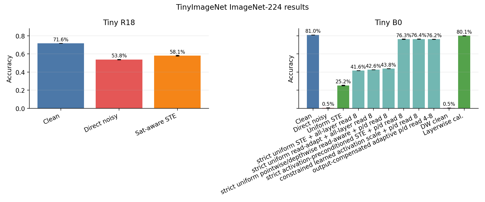

*图 2. TinyImageNet 224 输入下 ResNet18 与 EfficientNet-B0 的 clean、direct noisy、STE 和结构适配结果；逐层降噪结果仅作为辅助映射上限。*

结论：

- TinyImageNet 正式协议使用 224 输入与 ImageNet 预训练，使 ResNet18 和 EfficientNet-B0 的 clean baseline 具有可比性。
- ResNet18 在 noisy deployment 下显著退化，sat-aware STE fine-tune 能恢复 4.24 个百分点。
- EfficientNet-B0 direct noisy 接近随机，说明统一噪声映射不能直接覆盖所有架构。
- 在严格统一噪声下，早期 read-aware 路线达到 43.78%。加入 clean 统计驱动的激活预条件后，使用 plain STE、p/d 4 读训练和 p/d 8 读评估，5-seed full-val 达到 76.30% ± 0.25% CI95。该方案不降低单次读出的噪声强度，而是同时缓解系统性饱和偏差与随机读出误差。
- 受约束可学习缩放在 3 个配对 seed 上平均提高 0.09 pp，但 paired `p=0.247`，只能视为正趋势。输出补偿平均降低 0.073 pp，paired `p=0.568`，同时将敏感层读次数从 640 降到 477、full-val 时间从 300.2 s 降到 231.3 s。
- 对 EfficientNet-B0，将 pointwise noise scale 设为 0.05、linear noise scale 设为 0.1 后，noisy accuracy 恢复到 80.09%。

### TinyImageNet EfficientNet-B0 中间层诊断

数据来源：

- `runs/tinyimagenet_efficientnet_b0_clean_layer_noise_decomposition_seed1.csv`
- `docs/figures/tinyimagenet_efficientnet_b0_clean_layer_noise_decomposition_seed1.png`
- `runs/tinyimagenet_efficientnet_b0_activation_preconditioning_summary.csv`

统计方式：对 checkpoint 运行 clean forward 和 4 次独立 noisy forward。总误差由 noisy-clean MSE 计算；随机方差由独立 noisy read 的成对差分估计；剩余项作为系统偏差。clean checkpoint 上 depthwise 的总/随机/系统 RMS ratio 分别约为 0.832/0.142/0.818，pointwise 分别约为 0.883/0.236/0.838。系统偏差占主导，支持优先修正 forward 饱和；随机项仍足以使多次读出带来增益。

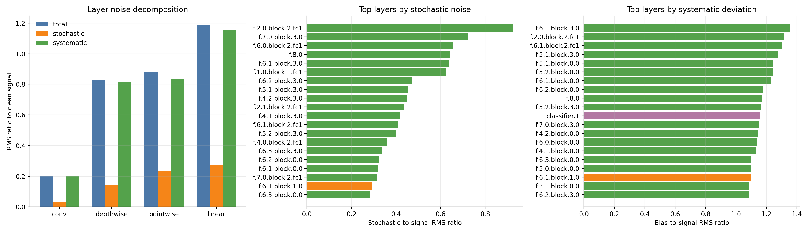

*图 3. EfficientNet-B0 clean checkpoint 的逐层总误差、随机分量和系统分量。pointwise/depthwise 中系统偏差占主导，是激活预条件的直接诊断依据。*

### Layer-wise calibration

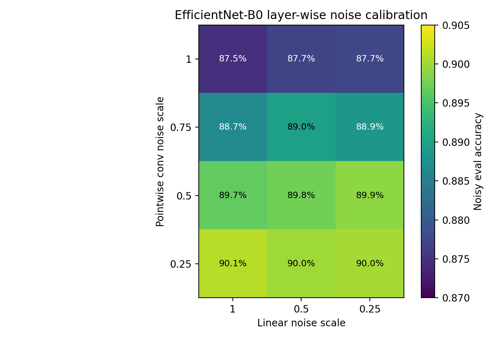

*图 4(a). CIFAR-10 EfficientNet-B0 的层类型噪声敏感性扫描。*

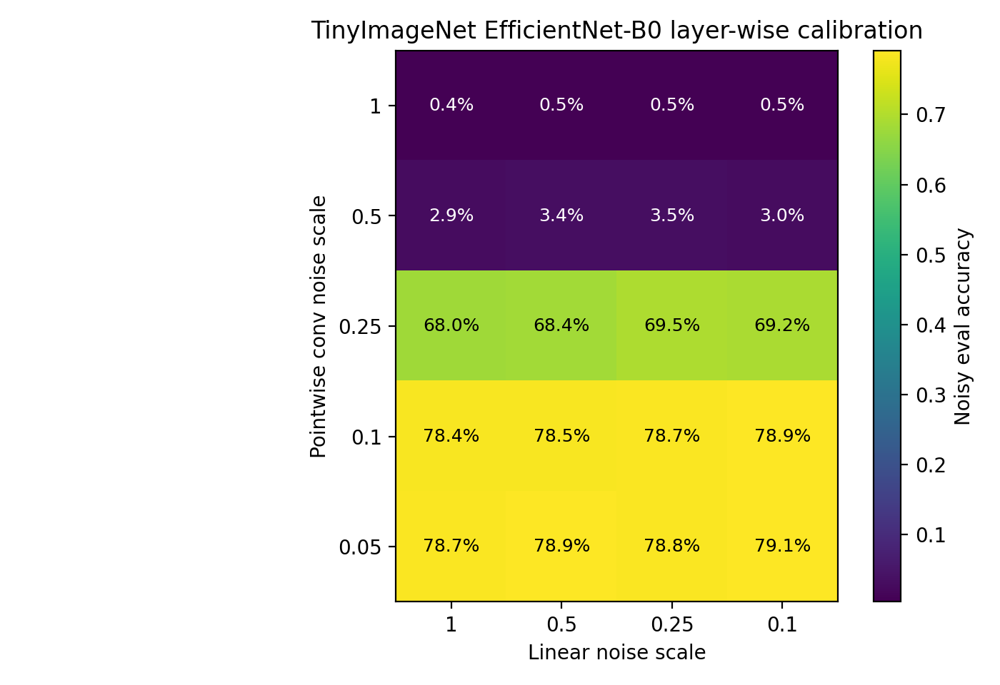

*图 4(b). TinyImageNet EfficientNet-B0 的层类型噪声敏感性扫描；该扫描用于诊断，不计入严格统一噪声主结果。*

关键观察：

- 在 CIFAR-10 EfficientNet-B0 中，pointwise convolution 是主要噪声敏感层，将 pointwise scale 调到 0.25 后 noisy accuracy 超过 90%。
- 在 TinyImageNet EfficientNet-B0 中，pointwise scale 从 1.0 降至 0.1/0.05 后，accuracy 从随机附近跃迁到约 79% 到 80%。
- 这说明多架构适配不是简单保护 depthwise 层，而是需要识别 pointwise/linear 层的尺度敏感性。

### 统计显著性

数据来源：

- `runs/statistical_summary.csv`
- `runs/statistical_pairwise_comparisons.csv`
- `runs/statistical_anova.csv`

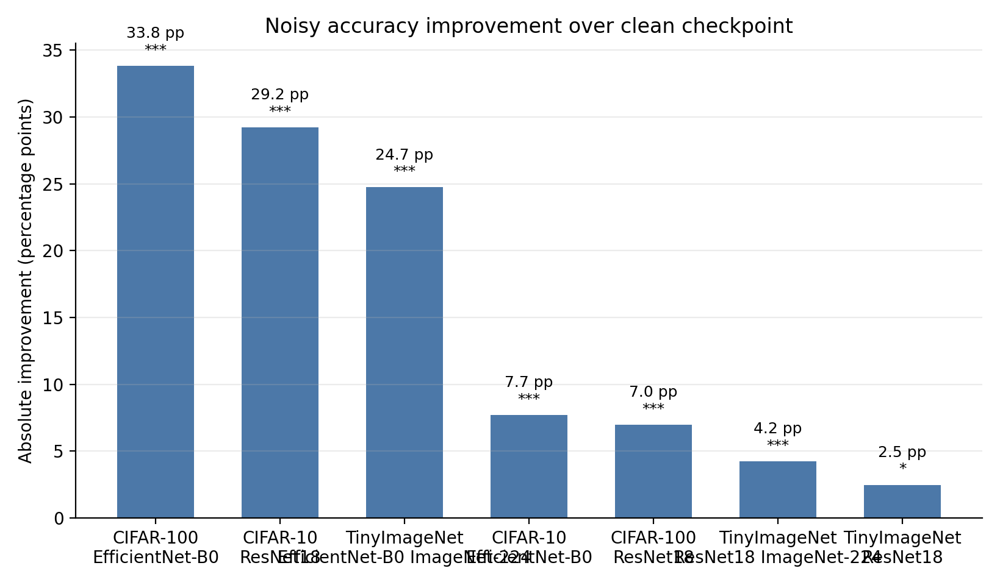

*图 5. 主要任务候选方法相对 baseline 的改进、95% 置信区间与显著性标记。不同任务的 baseline 口径以表中定义为准。*

| 任务 | baseline | candidate | improvement | p-value | significance |
| --- | --- | --- | ---: | ---: | --- |
| CIFAR-10 + ResNet18 | clean noisy | `ste` | +29.21 pp | 1.04e-6 | `***` |
| CIFAR-10 + EfficientNet-B0 | depthwise-clean noisy | pointwise calibrated method | +7.71 pp | 7.77e-8 | `***` |
| CIFAR-100 + ResNet18 | clean noisy | `adaptive_sat_aware_ste` | +6.98 pp | 1.63e-7 | `***` |
| CIFAR-100 + EfficientNet-B0 | clean noisy | `ste` | +33.84 pp | 2.23e-12 | `***` |
| TinyImageNet + ResNet18 ImageNet-224 | clean noisy | `sat_aware_ste` | +4.24 pp | 8.70e-4 | `***` |
| TinyImageNet + EfficientNet-B0 ImageNet-224 | direct noisy | layer-wise calibrated method | +79.59 pp | 2.54e-9 | `***` |

### 官方推荐工具 sanity check

脚本：`scripts/tool_sanity_check.py`

输出：

- `runs/tool_sanity_check.csv`
- `docs/figures/tool_sanity_check_error_hist.png`

该实验对比本地 noisy matmul、MemIntelli 和 mPimPy 在小矩阵乘上的误差分布。它不替代主训练框架，但作为 sanity check 说明本项目的矩阵乘噪声建模可以与外部 IMC 仿真工具建立对应关系。

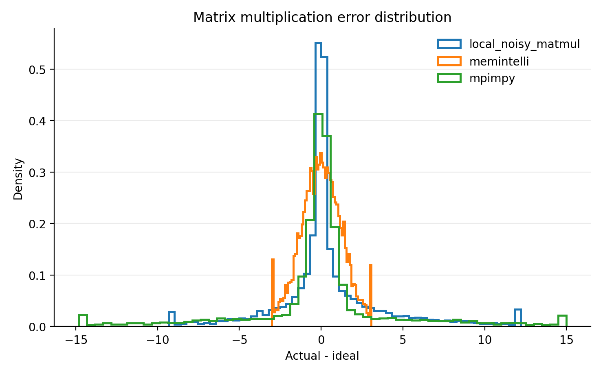

*图 6. 本地实现与两项推荐工具的小矩阵误差分布 sanity check。不同工具参数化并非严格等价，因此仅用于数量级检查。*

### 扩展任务验证：检测与语义分割

扩展实验把 `NoisyConv2d` 和 `NoisyLinear` 接入 Faster R-CNN 与 DeepLabV3 的内部层级。大分辨率卷积采用分块 unfold；编程、漂移、保持、温度和供电状态在一次物理读内跨空间块与 MAC tile 共享，输入串扰和输出噪声仍按位置采样。因此，分块只降低峰值内存，不改变完整噪声语义。

数据来源：`runs/optional_full_validation_summary.csv`

| 扩展任务 | Clean full-val | Direct noisy | 1-epoch STE | Recovery |
| --- | ---: | ---: | ---: | ---: |
| VOC2007 + Faster R-CNN / mAP50 | 72.59% | 28.72% | 37.53% | +8.81 pp |
| VOC2012 + DeepLabV3 / mIoU | 71.31% | 4.03% | 6.46% | +2.43 pp |

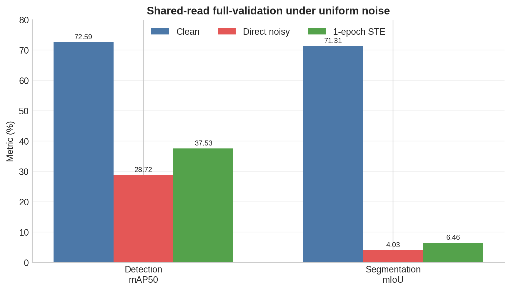

*图 7. `noise_scale=1.0`、shared-read 语义下的 clean、direct noisy 与一完整 epoch STE 结果。*

模块级统计显示，检测 backbone/FPN/RPN/ROI 的 residual-to-signal 分别为 0.523、0.676、0.825 和 1.096；分割 backbone/classifier/aux-classifier 分别为 0.756、1.077 和 0.913。所有采样均无 shape mismatch 或 non-finite 输出，表明主要限制来自任务 head 与深层特征的噪声敏感性，而非执行错误。

在线 profile 在训练 batch 内执行配对 clean/noisy 前向。对输出通道 $c$，残差先投影到 clean signal 以估计系统增益偏差 $b_c$，正交分量给出随机方差 $v_c$；EMA 统计映射为有界 surrogate scale：

$$
s_c=\operatorname{clip}\left((1+\lambda_v v_c+\lambda_b b_c^2)^{-1/2}, s_{\min},1\right). \tag{14}
$$

三种子配对结果来自 `runs/optional_paired_extension_summary.csv`：

| 方法 | Control | Candidate | Paired delta | CI95 | $p$ | Positive seeds |
| --- | ---: | ---: | ---: | ---: | ---: | ---: |
| Detection online channel profile | 40.44% | 41.78% | +1.35 pp | ±3.95 pp | 0.280 | 2/3 |
| Detection proposal-aligned teacher | 39.40% | 40.05% | +0.65 pp | ±5.27 pp | 0.648 | 2/3 |
| Segmentation online profile + consistency + range control | 6.50% | 6.74% | +0.245 pp | ±0.099 pp | 0.0086 | 3/3 |

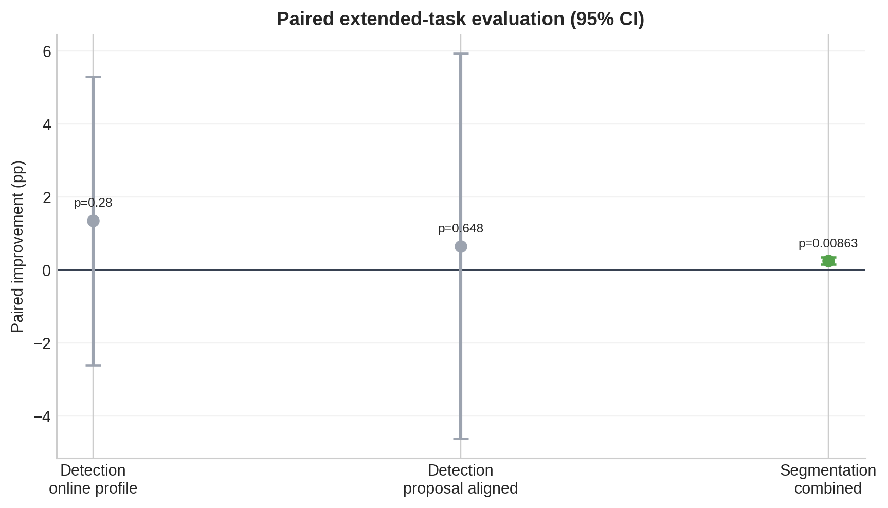

*图 8. 在线通道 profile 与任务一致性方法相对 matched control 的三种子配对差值。*

完整一轮结果记录于 `runs/optional_full_epoch_extension.csv`。分割组合方法由 5.950% 提升到 6.210% mIoU（+0.260 pp），验证了短程统计改善可延续；其绝对精度仍低于 6.46% 的最佳 STE full-val。检测两项配对差异均不显著，因此仅作为机制分析。上述 VOC 实验不替代 COCO 或 Cityscapes 官方 benchmark。

## 消融与诊断

### 梯度诊断

脚本：`scripts/analyze_gradients.py`

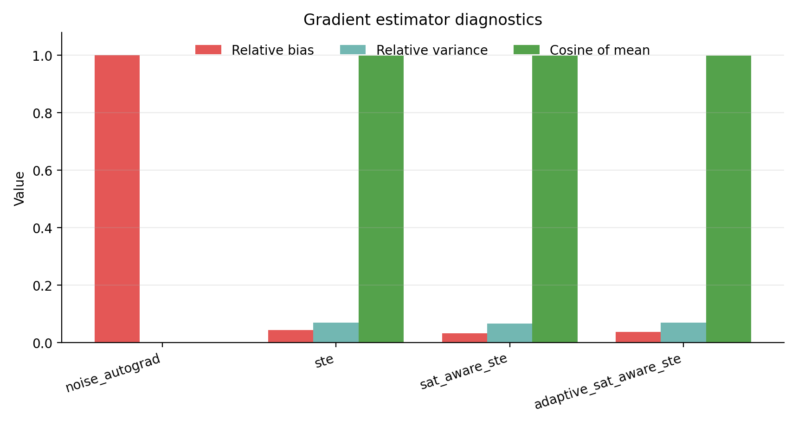

*图 9. direct noisy autograd、标准 STE 与饱和感知 STE 的梯度范数、偏差、方差和方向一致性诊断。*

关键结论：

- direct noisy autograd 在量化和随机噪声路径下容易出现无效梯度。
- 标准 STE 恢复了可传播梯度。
- saturation-aware 与 adaptive saturation-aware 进一步控制了大响应区域的梯度偏差和方差。

### 噪声强度 sweep

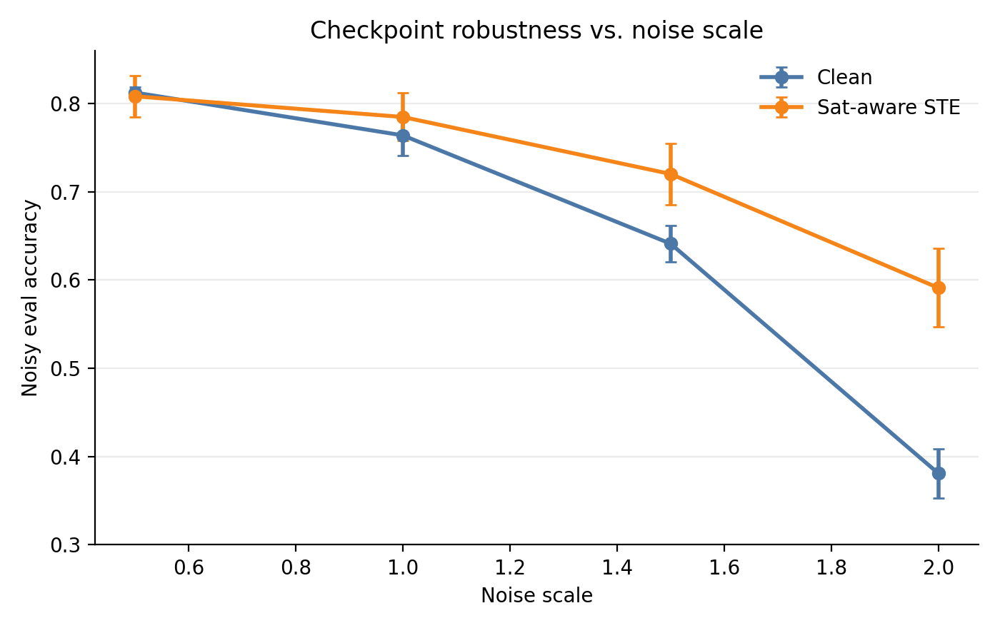

*图 10. 噪声倍率增大时不同训练策略的部署精度变化；比较均基于相同评估协议。*

结论：

- 随着 noise scale 增大，clean checkpoint 的 direct noisy eval 退化更快。
- STE 类训练在强噪声下保留更高鲁棒性。

## 工程效率实验

在 RTX 4090、PyTorch 2.6.0、CUDA 12.6 上，以 CIFAR stem ResNet18、batch 8、32x32 固定合成输入测量 10 步 warmup 后的 50 个完整训练步骤。每步包含 `zero_grad`、forward、交叉熵、backward 和 SGD update；在线路径还完整计入 paired clean forward、逐通道统计与 noisy forward。

| 路径 | Mean step | 相对 clean | Throughput | 增量峰值显存 |
| --- | ---: | ---: | ---: | ---: |
| clean | 4.87 ms | 1.00x | 1643.94 images/s | 35.50 MiB |
| plain STE | 25.71 ms | 5.28x | 311.12 images/s | 278.35 MiB |
| online profile STE | 47.96 ms | 9.86x | 166.80 images/s | 296.45 MiB |

在线 profile 相对普通 STE 的时间倍率为 1.87x，额外增量峰值显存为 18.10 MiB。主要成本来自第二次 forward，逐通道统计状态只增加较小显存；profile 仅用于训练，部署推理不执行。该 microbenchmark 不含数据加载，也不构成独立运行置信区间，结论仅限于上述固定环境。原始数据与环境元数据分别位于 `runs/efficiency_benchmark.csv` 和 `runs/efficiency_benchmark_metadata.json`。

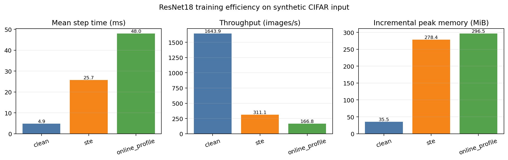

*图 11. 三条训练路径的平均单步时间、吞吐和相对模型常驻基线的峰值已分配显存。*

## 工程实现清单

| 模块 | 文件 | 作用 |
| --- | --- | --- |
| 噪声模型 | `src/imc_ste/noise.py` | noisy/grouped matmul、噪声配置、物理读状态采样与切片 |
| STE | `src/imc_ste/ste.py` | 标准、饱和感知、自适应饱和感知、方差感知 STE |
| 层替换 | `src/imc_ste/layers.py` | NoisyLinear、NoisyConv2d、depthwise clean hybrid |
| 模型转换 | `src/imc_ste/convert.py` | 递归替换 Conv/Linear，统计梯度配置、激活预条件、可学习缩放和读预算设置 |
| 训练入口 | `scripts/train.py` | 训练、评估、TinyImageNet、ImageNet-224 |
| 批量实验 | `scripts/run_matrix.py`、`scripts/run_two_stage_formal.py` | 实验矩阵和 two-stage 训练 |
| checkpoint 评估 | `scripts/evaluate_checkpoint.py` | repeat noisy eval、MC logits eval、layer read repeat 与耗时评估 |
| 自适应实验统计 | `scripts/summarize_repeated_eval.py`、`scripts/compare_paired_evaluations.py` | repeat mean/CI、配对 t-test、精度与成本汇总 |
| 统计分析 | `scripts/statistical_analysis.py` | CI、t-test、ANOVA、effect size |
| 绘图 | `scripts/plot_results.py` | 报告图表生成 |
| 扩展任务 full-val 汇总 | `scripts/build_key_results.py` | shared-read 检测与分割结果 |
| 任务输出一致性 | `src/imc_ste/task_consistency.py` | RPN 对齐输出与分割像素 logits 约束 |
| 在线 profile | `src/imc_ste/online_profile.py` | 逐通道在线 bias/variance 分解、EMA 与有界 surrogate scale |
| Proposal-aligned ROI | `src/imc_ste/proposal_consistency.py` | clean proposals 上的 teacher、真实标签及前景目标 |
| 扩展任务配对评估 | `scripts/run_optional_nextgen_repeats.py` | 在线方法的 3-seed 与 full-epoch 验证 |
| 工程效率 | `scripts/benchmark_efficiency.py` | clean、plain STE 与在线 profile 的训练步成本 |
| 关键表重建 | `scripts/build_key_results.py` | 校验主结果算术一致性并重建提交表图 |
| 一键复核 | `scripts/smoke_test.py`、`scripts/verify_project.py` | dataset-free smoke、48 项测试与产物哈希检查 |

## 结论

1. 本项目实现了一个覆盖线性层、普通卷积、grouped convolution 和 depthwise convolution 的通用噪声感知 STE 框架。
2. 对于带量化和随机扰动的 noisy forward，直接 autograd 或普通 noisy training 容易失效，STE 可以恢复有效梯度传播。
3. `sat_aware_ste` 和 `adaptive_sat_aware_ste` 在多个任务中带来显著 noisy accuracy recovery。
4. EfficientNet-B0 的实验表明，多架构适配是必要的。depthwise、pointwise 和 linear 层的噪声敏感性不同，逐层校准可以作为辅助硬件映射分析，但不计入严格统一噪声主线。
5. 严格统一噪声主线下，CIFAR-10 + ResNet18 达到 90.63%；CIFAR-10 + EfficientNet-B0 达到 86.12%。TinyImageNet + EfficientNet-B0 从 direct noisy 0.50% 恢复到 5-seed mean 76.30%，保留 94.20% clean 精度，证明针对层类型的统计激活预条件与 read-aware STE 可以在不降低噪声强度的情况下显著修复饱和敏感架构。
6. 受约束可学习缩放未形成统计显著的额外精度提升；输出噪声感知 4-8 读预算则在精度差异不显著时减少 25.5% 逻辑读次数和 23.0% 实测评估时间。moment-matched 训练降低了训练成本，最终微调与评估仍采用精确读出。
7. 扩展检测/分割实验完成了内部层级接入、大图卷积共享读状态和模块诊断。分割在线联合方法在 3-seed 中提升 `+0.245 pp` (`p=0.0086`) 并在 full epoch 保持 `+0.260 pp`；检测配对差异不显著。VOC 最佳绝对值为 37.53% mAP50 与 6.46% mIoU，不能替代 COCO/Cityscapes benchmark。

## 可复现性

项目提供锁定版本的 `environment.yml`、完整 `pyproject.toml`、无数据集 smoke、48 项单元测试、关键结果表重建和产物哈希检查。最小复核流程为：

```bash
conda env create -f environment.yml
conda activate imc-ste
python scripts/verify_project.py
```

`verify_project.py` 顺序执行 dataset-free STE/在线 profile smoke、测试套件、关键结果算术校验和表图重建。正式训练命令、数据集下载方式与 checkpoint 评估命令见 `README.md`。精简提交包不包含数据集和大体积 checkpoint；完整训练复现需要按 README 获取公开数据并重新训练，关键报告表可直接由包内的审计 CSV 重建。

## 结论边界

1. 必选分类主结果统一使用 `noise_scale=1.0`；激活预条件不降低任一层的噪声参数，多读改变采样预算而非单次读噪声幅度。
2. layer-wise noise reduction 仅用于诊断与硬件映射上限，不与严格统一噪声主结果混排。
3. TinyImageNet 是经确认的 ImageNet 方向替代任务，不等同于 ImageNet-1K 官方验证集。
4. Optional 检测/分割使用 VOC 完成内部层级链路、full-val 与机制研究，不满足题目原始 COCO/Cityscapes 加分口径，因此不宣称 optional 已按官方数据集完整达成。
5. MemIntelli/mPimPy 结果是小矩阵 sanity check，不是硬件精度认证。
6. 式 (12) 依赖 smoothness、有界偏差和方差等假设，用于解释优化机制，不构成对任意深网最终精度的保证。
7. 工程效率仅代表指定 RTX 4090、软件版本、ResNet18、batch 8 和 32x32 输入下的训练步骤 microbenchmark。

## 参考文献

[1] 2026 INNO 赛道五赛题二任务书，`2026INNO_CIM.docx`，2026。

[2] Y. Bengio, N. Léonard, and A. Courville, “Estimating or Propagating Gradients Through Stochastic Neurons for Conditional Computation,” arXiv:1308.3432, 2013.

[3] M. Courbariaux, Y. Bengio, and J.-P. David, “BinaryConnect: Training Deep Neural Networks with Binary Weights during Propagations,” NeurIPS, 2015.

[4] P. Yin, J. Lyu, S. Zhang, S. Osher, Y. Qi, and J. Xin, “Understanding Straight-Through Estimator in Training Activation Quantized Neural Nets,” ICLR, 2019.

[5] L. Bottou, F. E. Curtis, and J. Nocedal, “Optimization Methods for Large-Scale Machine Learning,” SIAM Review, vol. 60, no. 2, pp. 223-311, 2018.

[6] T. Gokmen and Y. Vlasov, “Acceleration of Deep Neural Network Training with Resistive Cross-Point Devices: Design Considerations,” Frontiers in Neuroscience, vol. 10, 2016.

[7] M. Le Gallo et al., “Mixed-Precision In-Memory Computing,” Nature Electronics, vol. 1, pp. 246-253, 2018.

[8] K. He, X. Zhang, S. Ren, and J. Sun, “Deep Residual Learning for Image Recognition,” CVPR, 2016.

[9] M. Tan and Q. Le, “EfficientNet: Rethinking Model Scaling for Convolutional Neural Networks,” ICML, 2019.

[10] S. Ren, K. He, R. Girshick, and J. Sun, “Faster R-CNN: Towards Real-Time Object Detection with Region Proposal Networks,” NeurIPS, 2015.

[11] L.-C. Chen, G. Papandreou, F. Schroff, and H. Adam, “Rethinking Atrous Convolution for Semantic Image Segmentation,” arXiv:1706.05587, 2017.
